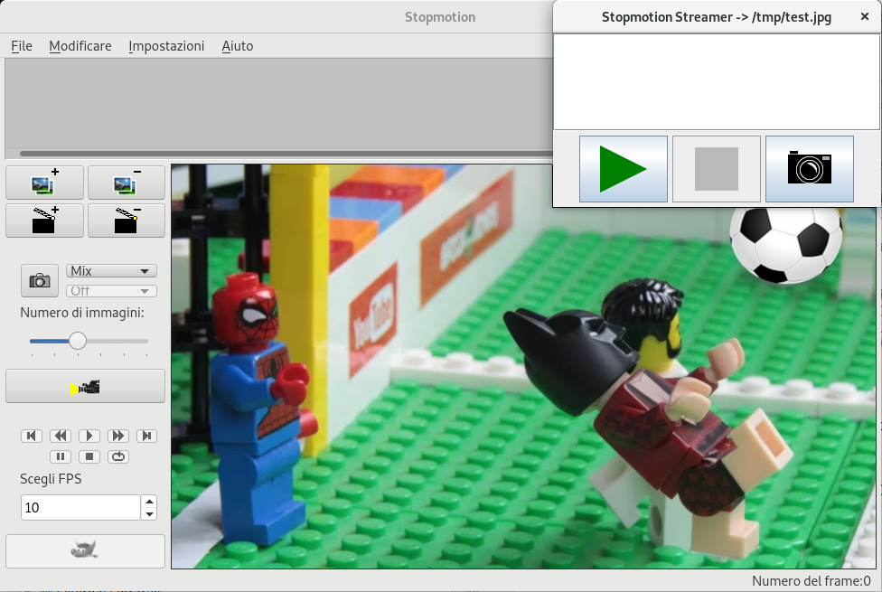

# GPhoto Streamer
> Stream photos from your camera to [linuxstopmotion](http://linuxstopmotion.org/index.html) over [gphoto2](https://github.com/gphoto/gphoto2)

GPhoto Streamer is a tool born from two main needs:
* make my digital camera usable from linuxstopmotion (now that I know it's [usable from gphoto2](https://github.com/gphoto/libgphoto2/issues/325))
* have some practice with Kotlin



The Streamer shows a crude toolbar from where one can start and stop image acquisition as a stream of low-res thumbnails, while moving pieces on the scene. Then, once one's satisfied with their job, they may take high-resolution snapshots using the camera button.

## Installation

Install gphoto2. Make shure to grab the latest version of libgphoto2 that supports your camera.

Clone the repository and build:
```sh
./gradlew clean shadowJar
```

Copy the jar and the startup script under a $PATH folder:
```sh
cp build/libs/gphoto-streamer-*-all.jar ~/.local/lib
cp gphoto-streamer ~/.local/bin
```

## Usage

Use the tool in dialog mode:
```sh
gphoto-streamer runonce <captured file path>
```

Start the tool:
```sh
gphoto-streamer start <captured file path>
```

Kill it with:
```sh
gphoto-streamer stop
```

## Integration with linuxstopmotion

_Stay tuned..._

## Release History

* 0.0.1
    * Work in progress

## Meta

Marco Bolis – mbolis 1984 (followed by the `at` sign) gmail (guess what...) com

Distributed under the MIT license. See ``LICENSE`` for more information.

## Contributing

1. Fork it (<https://github.com/mbolis/gphoto-streamer/fork>)
2. Open an issue to describe the changes you want to propose
2. Create your feature branch with the issue id (`git checkout -b ##`)
3. Commit your changes (`git commit -am 'Add some nice features'`)
4. Push to the branch (`git push origin ##`)
5. Create a new Pull Request
